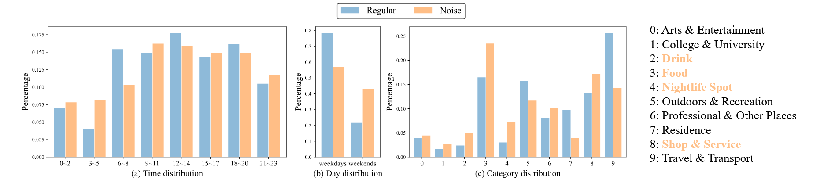
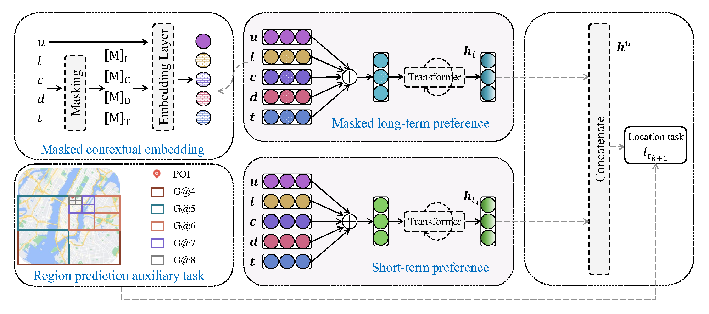

# RTP-CM

This is the pytorch implementation of paper "[Learning Robust Travel Preferences via Check-in Masking for Next POI Recommendation](https://www.sciencedirect.com/science/article/pii/S0957417424029737)"





## Installation

```
pip install -r requirements.txt
```

## Valid requirements

```
torch==2.0.1
numpy==1.24.3
pandas==2.0.2
Pillow==9.4.0
python-dateutil==2.8.2
pytz==2023.3
six==1.16.0
torchvision==0.15.2
typing_extensions==4.5.0
```

## Train

- Unzip `raw_data/raw_data.zip` to `raw_data/`. The three files are PHO, NYC and SIN check-in data.

- Run `data_preprocessor.py` to construct input data.
  - Or unzip `processed_data/processed_data.zip` to `processed_data/`.

- Train and evaluate the model using python `main.py`.

- The training and evaluation results will be stored in `result` folder.

```
python main.py --name NYC_auto0.4
                --run-times 1
                --device cuda:0
                --dataset NYC
                --mask-strategy 0 --mask-proportion 0.4
                --area-proportion 0.2
                --embed-size 60 
                --transformer-layers 1 --transformer-heads 1
                --dropout 0.2
                --epochs 40
                --lr 1e-5
```

## Cite our paper 🫡

### ESWA2024

	@article{RTP-CM2024,
		title = {Learning robust travel preferences via check-in masking for next {POI} recommendation},
		issn = {0957-4174},
		doi = {10.1016/j.eswa.2024.126106},
		pages = {126106},
		journaltitle = {Expert Systems with Applications},
		shortjournal = {Expert Systems with Applications},
		author = {Duan, Chenghua and Wen, Junhao and Zhou, Wei and Zeng, Jun and Zhang, Yihao},
		date = {2024-12-18},
		keywords = {Masking strategy, Noise reduction, {POI} recommendation}
	}

## Links may be useful ✨

- [Geospatial Indexing - Geohash](https://h3geo.org/docs/comparisons/geohash/)
- [Efficient Multidimensional Spatial Point Indexing Algorithms—Geohash and Google S2](https://halfrost.com/go_spatial_search/)
